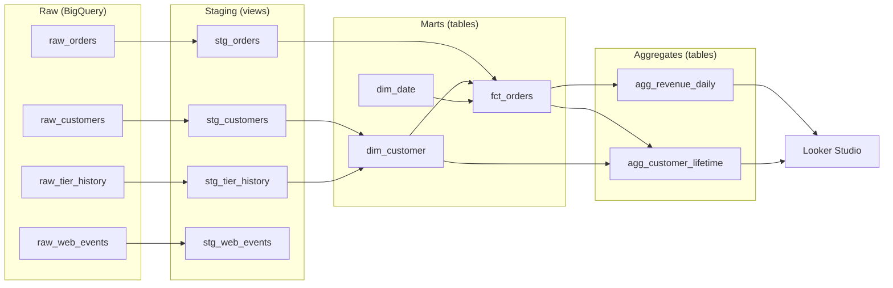

# weekend-warehouse

A small but realistic analytics warehouse, built end-to-end in one focused
weekend with Claude as a pair programmer. The project demonstrates the core
patterns that real ETL pipelines exercise — multi-source identity resolution,
slowly-changing dimensions, sessionization, star-schema modeling, data
quality testing, and pre-aggregation for dashboards — and openly documents
how AI was used at each step so reviewers can see both the engineering and
the AI-augmented workflow.

> **Status:** in progress (weekend build). See [project status](#project-status)
> for what's done vs. what's left.

---

## What this project shows

If you're a hiring manager, the short version of what's in here:

- A **multi-source pipeline** that ingests three deliberately mismatched
  source systems (an app database, a CRM, and a clickstream) into a
  BigQuery warehouse.
- A **star schema** with `fct_orders`, `dim_customer` (Type 2 SCD), and
  `dim_date`, plus a daily revenue aggregate for fast dashboard queries.
- **Identity resolution** across sources that don't share a clean key —
  customers are matched by normalized email even when casing varies between
  systems and some checkouts have no CRM record at all.
- A **dbt project** with staging → intermediate → marts layering, tests on
  surrogate keys and referential integrity, and auto-generated lineage docs.
- A **Looker Studio dashboard** answering specific business questions
  ([view dashboard](https://datastudio.google.com/reporting/88b40f6f-005f-4fa0-95ea-f61e1491f2be)).
- **Documented AI workflow** — see [`DECISIONS.md`](./DECISIONS.md) and
  [`prompts/`](./prompts/) for the prompts that drove each stage and the
  cases where I overrode the AI suggestion.

---

## Architecture



The high-level shape:

```
  raw_orders.csv      ─┐
  raw_customers.csv   ─┼──► BigQuery raw dataset ──► dbt ──► star schema ──► Looker Studio
  raw_tier_history    ─┤      (3 sources)              (staging→marts→agg)     (dashboard)
  raw_web_events.csv  ─┘
```

Three layers in the warehouse:

| Layer | Schema | What lives here |
| --- | --- | --- |
| Raw | `raw` | CSV uploads from the source-system mocks, untouched. |
| Staging | `staging` | One model per source: type-cast, renamed columns, test rows filtered. |
| Marts | `marts` | `fct_orders`, `dim_customer` (SCD2), `dim_date`. |
| Reporting | `marts` | `agg_revenue_daily` (pre-aggregated for the dashboard). |

---

## How I worked with AI on this

This project is partly a demonstration of how to *use* AI productively on
real engineering work, not just what AI can produce. The workflow:

1. **I wrote the project scope and architecture** before any code was generated.
   AI didn't decide what we'd build, in what order, or what patterns to use.
2. **AI drafted code, I reviewed every model**. For each dbt model, AI wrote
   a first pass, I reviewed it for correctness and convention, and changes
   went into the file. The places where I pushed back are logged in
   [`DECISIONS.md`](./DECISIONS.md).
3. **Prompts are committed**. The `prompts/` directory contains the actual
   prompts I used at key decision points, not retrofitted ones. They're
   imperfect — that's the point.
4. **I tested everything I committed**. The dbt tests in this project all
   exist because I asked "what could break this?" and translated the answer
   into a test, often with AI's help drafting the SQL.

The [`DECISIONS.md`](./DECISIONS.md) log captures real moments where AI
suggested something I rejected or modified, with the reasoning. Examples
include explicit column lists over `SELECT *`, splitting a too-large model
into staging + intermediate + mart, and adding `unique` tests on surrogate
keys that AI didn't propose by default.

---

## Project structure

```
weekend-warehouse/
├── README.md
├── DECISIONS.md           ← log of AI overrides and modeling choices
├── data_generator/
│   ├── generate.py        ← synthetic data (stdlib only, no external deps)
│   └── requirements.txt
├── data/raw/              ← generated CSVs (gitignored; regenerate locally)
├── prompts/               ← the actual prompts used at each stage
├── dbt_project/           ← the dbt project (models, tests, docs)
└── docs/
    └── architecture.svg   ← architecture diagram
```

---

## Running it locally

This project assumes you have:
- Python 3.10+
- A free-tier GCP project with BigQuery enabled
- A service-account JSON key file
- dbt-bigquery installed (`pip install dbt-bigquery`)

```bash
# 1. Generate the source CSVs
python data_generator/generate.py

# 2. Upload to BigQuery (one-time setup; see docs/setup.md)
#    Creates the `raw` dataset and loads the four CSVs as tables.

# 3. Configure dbt
cp dbt_project/profiles.yml.example ~/.dbt/profiles.yml
# Edit profiles.yml with your GCP project ID and service-account path.

# 4. Run the pipeline
cd dbt_project
dbt deps
dbt build      # runs models + tests
dbt docs generate && dbt docs serve   # open the lineage graph
```

---

## Source data

Three pretend source systems with deliberate real-world quirks:

| Source | File | Rows | Notes |
| --- | --- | --- | --- |
| App DB (orders) | `raw_orders.csv` | 8,000 | ~10% guest checkouts, ~2% test rows, ~1% refunds |
| CRM (customers) | `raw_customers.csv` | 2,000 | Email casing inconsistent vs. orders |
| CRM (tier log) | `raw_tier_history.csv` | ~2,400 | ~30% of customers have tier upgrades (SCD2 source) |
| Web events | `raw_web_events.csv` | 30,000 | ~40% logged-in, ~5% identity-stitched mid-session |

Quirks injected on purpose so the pipeline has real work to do:

- **Inconsistent casing**: same email can appear as `priya@x.com` in CRM and
  `Priya@X.com` in orders. Joining requires a normalization step.
- **Guest checkouts**: ~10% of orders use emails not present in the CRM —
  the pipeline has to handle "customer exists in fact table but not dim table."
- **Tier history with gaps**: tier rows have only `valid_from`. Building
  SCD2 requires deriving `valid_to` and `is_current` flags.
- **Anonymous-to-identified stitching**: some web events start with no email,
  then later events under the same `anonymous_id` are logged in. This is
  the standard sessionization-with-identity-resolution problem.
- **Test/refund rows**: a small fraction of order rows are test data
  (status='test') or negative-amount refunds — staging has to filter or
  handle them deliberately.

---

## Known limitations

**Orphan orders in `fct_orders`.** About 3,270 orders (~$559K of revenue) have
`NULL customer_key` because their timestamps fall outside any SCD2 tier-period
date range for the matched customer. This is a side effect of the synthetic data
generator producing order timestamps independently of customer signup dates. In a
production setting this is the same pattern as a "late-arriving dimension" or a
retroactive CRM record, and would be handled by either extending the earliest
`valid_from` per customer to cover their first order date, or by introducing a
sentinel "unknown version" dim row for unattributed facts. The lifetime aggregate
(`agg_customer_lifetime`) sidesteps this by aggregating on the conformed
`customer_email` rather than `customer_key`, which is why it produces correct
totals despite the orphan rows.

---

## Project status

- [x] Synthetic data generator
- [x] Repo + README scaffolding
- [x] BigQuery + dbt connection
- [x] Staging models (`stg_customers`, `stg_orders`, `stg_tier_history`, `stg_web_events`)
- [x] Marts: `fct_orders`, `dim_customer` (SCD2), `dim_date`
- [x] Aggregates: `agg_revenue_daily`, `agg_customer_lifetime`
- [x] Tests (accepted values, uniqueness, referential integrity, totals-match assertions)
- [ ] Looker Studio dashboard
- [ ] Architecture diagram + final docs polish

---

## License

MIT — do whatever you want with it.
