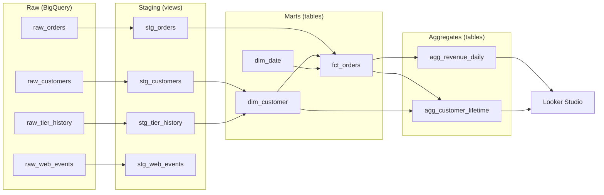

# weekend-warehouse

A small but realistic analytics warehouse, built end-to-end in one focused
weekend with Claude as a pair programmer. The project demonstrates the core
patterns that real ETL pipelines exercise — multi-source identity resolution,
slowly-changing dimensions, sessionization, star-schema modeling, data
quality testing, and pre-aggregation for dashboards — and openly documents
how AI was used at each step so reviewers can see both the engineering and
the AI-augmented workflow.

---

## Live dashboard

[View the Looker Studio dashboard](https://datastudio.google.com/reporting/88b40f6f-005f-4fa0-95ea-f61e1491f2be) — daily revenue trends, acquisition channel mix, and customer tier distribution.

---

## What this project shows

If you're a hiring manager, the short version of what's in here:

- A **multi-source pipeline** that ingests three deliberately mismatched
  source systems (an app database, a CRM, and a clickstream) into a
  BigQuery warehouse.
- A **star schema** with `fct_orders`, `dim_customer` (Type 2 SCD), and
  `dim_date`, plus a daily revenue aggregate for fast dashboard queries.
- **Identity resolution** across sources that don't share a clean key —
  customers are matched by normalized email even when casing varies between
  systems and some checkouts have no CRM record at all.
- A **dbt project** with staging → marts layering, auto-generated lineage docs, and 6 dbt tests covering uniqueness, not-null constraints, accepted values, composite-key uniqueness, and two custom totals-match integrity tests.
- A **real debugging story.** A custom totals-match integrity test caught a $638K discrepancy in a customer-lifetime aggregate, which traced to a subtle SCD2 multi-version aggregation issue. The diagnosis and fix are documented in [`DECISIONS.md`](./DECISIONS.md) entries #4 and #5.
- **Documented AI workflow** — see [`DECISIONS.md`](./DECISIONS.md) for the cases where I overrode the AI suggestion and why.

---

## Architecture



Three layers in the warehouse:

| Layer | Schema | What lives here |
| --- | --- | --- |
| Raw | `raw` | CSV uploads from the source-system mocks, untouched. |
| Staging | `staging` | One model per source: type-cast, renamed columns, test rows filtered. |
| Marts | `marts` | `fct_orders`, `dim_customer` (SCD2), `dim_date`, `agg_revenue_daily`, `agg_customer_lifetime`. |

---

## How I worked with AI on this

I scoped the architecture and decided what to build before writing any code. AI drafted each dbt model; I reviewed every one for correctness and convention before it was committed. Where I pushed back on an AI suggestion, I noted the reasoning rather than just making the change silently.

[`DECISIONS.md`](./DECISIONS.md) is the paper trail: six entries covering cases where AI's first pass was wrong or incomplete, from column-selection conventions to a multi-step debugging session that caught a $638K aggregation error. It's the place to look if you want to understand where the judgment calls happened and why.

---

## Project structure

```
weekend-warehouse/
├── README.md
├── DECISIONS.md           ← log of AI overrides and modeling choices
├── data_generator/
│   ├── generate.py        ← synthetic data (stdlib only, no external deps)
│   └── requirements.txt
├── data/raw/              ← generated CSVs (gitignored; regenerate locally)
├── dbt_project/           ← the dbt project (models, tests, docs)
└── docs/
    └── setup.md           ← BigQuery setup guide
```

---

## Running it locally

This project assumes you have:
- Python 3.10+
- A free-tier GCP project with BigQuery enabled
- A service-account JSON key file
- dbt-bigquery installed (`pip install dbt-bigquery`)

```bash
# 1. Generate the source CSVs
python data_generator/generate.py

# 2. Upload to BigQuery (one-time setup; see docs/setup.md)
#    Creates the `raw` dataset and loads the four CSVs as tables.

# 3. Configure dbt
cp dbt_project/profiles.yml.example ~/.dbt/profiles.yml
# Edit profiles.yml with your GCP project ID and service-account path.

# 4. Run the pipeline
cd dbt_project
dbt deps
dbt build      # runs models + tests
dbt docs generate && dbt docs serve   # open the lineage graph
```

---

## Source data

Three pretend source systems with deliberate real-world quirks:

| Source | File | Rows | Notes |
| --- | --- | --- | --- |
| App DB (orders) | `raw_orders.csv` | 8,000 | ~10% guest checkouts, ~2% test rows, ~1% refunds |
| CRM (customers) | `raw_customers.csv` | 2,000 | Email casing inconsistent vs. orders |
| CRM (tier log) | `raw_tier_history.csv` | ~2,400 | ~30% of customers have tier upgrades (SCD2 source) |
| Web events | `raw_web_events.csv` | 30,000 | ~40% logged-in, ~5% identity-stitched mid-session |

Quirks injected on purpose so the pipeline has real work to do:

- **Inconsistent casing**: same email can appear as `priya@x.com` in CRM and
  `Priya@X.com` in orders. Joining requires a normalization step.
- **Guest checkouts**: ~10% of orders use emails not present in the CRM —
  the pipeline has to handle "customer exists in fact table but not dim table."
- **Tier history with gaps**: tier rows have only `valid_from`. Building
  SCD2 requires deriving `valid_to` and `is_current` flags.
- **Anonymous-to-identified stitching**: some web events start with no email,
  then later events under the same `anonymous_id` are logged in. This is
  the standard sessionization-with-identity-resolution problem.
- **Test/refund rows**: a small fraction of order rows are test data
  (status='test') or negative-amount refunds — staging has to filter or
  handle them deliberately.

---

## Known limitations

**Orphan orders in `fct_orders`.** About 3,270 orders (~$559K of revenue) have
`NULL customer_key` because their timestamps fall outside any SCD2 tier-period
date range for the matched customer. This is a side effect of the synthetic data
generator producing order timestamps independently of customer signup dates. In a
production setting this is the same pattern as a "late-arriving dimension" or a
retroactive CRM record, and would be handled by either extending the earliest
`valid_from` per customer to cover their first order date, or by introducing a
sentinel "unknown version" dim row for unattributed facts. The lifetime aggregate
(`agg_customer_lifetime`) sidesteps this by aggregating on the conformed
`customer_email` rather than `customer_key`, which is why it produces correct
totals despite the orphan rows.

---

## What I'd build next

This project is intentionally small — a weekend's worth of work to show the core patterns. A few directions I'd take it next:

**Real CDC ingestion.** Replace the manual CSV loads with continuous change-data-capture via Fivetran, Airbyte, or Debezium. The dbt project wouldn't change; only the upstream loading would.

**Incremental materialization on `fct_orders`.** At any real scale, rebuilding the whole fact table on every `dbt run` is wasteful. Switching to dbt's `incremental` materialization with `unique_key = order_id` would drop rebuild times from minutes to seconds as the table grows.

**CI on dbt pull requests.** A GitHub Actions workflow that runs `dbt build` on every PR against an isolated CI dataset, catching model-breaking changes before merge. Roughly 50 lines of YAML; high signal-to-effort ratio.

**A `fct_web_sessions` fact table.** Sessionize the web-event stream (30-minute inactivity gap) and roll it up into a fact table. Unlocks funnel and conversion analysis — the natural next analytical question once revenue is solved.

**Fix the orphan orders.** Address the 3,270 NULL-customer_sk rows documented under Known limitations by extending each customer's earliest `valid_from` to cover their first order date. Roughly 20 lines of SQL in `dim_customer.sql` plus a `not_null` test on the foreign key.

---

## Project status

- [x] Synthetic data generator
- [x] Repo + README scaffolding
- [x] BigQuery + dbt connection
- [x] Staging models (`stg_customers`, `stg_orders`, `stg_tier_history`, `stg_web_events`)
- [x] Marts: `fct_orders`, `dim_customer` (SCD2), `dim_date`
- [x] Aggregates: `agg_revenue_daily`, `agg_customer_lifetime`
- [x] Tests (accepted values, uniqueness, referential integrity, totals-match assertions)
- [x] Looker Studio dashboard
- [x] Architecture diagram + final docs polish

---

## License

MIT — do whatever you want with it.
